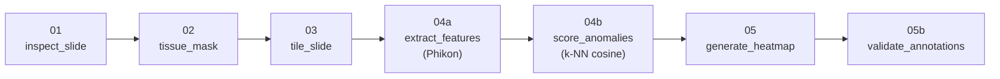

# Digital Pathology WSI Pipeline

A six-stage pipeline that takes a CAMELYON16 whole-slide image (~1–2 GB,
40× H&E scan of a sentinel lymph node) and produces an unsupervised
heatmap of unusual tissue regions, validated against ground-truth tumour
polygons.

Built as a portfolio project to demonstrate end-to-end whole-slide image
processing on Linux: OpenSlide, foundation-model feature extraction
(Phikon / Owkin ViT-Base), GPU inference, and quantitative validation.


*Left to right: slide thumbnail, anomaly-score heatmap, heatmap overlay,
and overlay with the CAMELYON16 ground-truth tumour polygons (magenta).
Hottest tiles cluster around tissue edges throughout the upper blobs
(geometric noise) but also pick out the right-side polygon interior in
the lower blobs — the source of the 83% recall at 13% precision below.*

## Result on `tumor_001`

| Metric | Value |
|---|---:|
| Tissue tiles (after masking) | 5,979 |
| Tiles inside ground-truth tumour polygons | 47 (0.8%) |
| Mean anomaly score inside tumour | 0.348 |
| Mean anomaly score outside tumour | 0.169 |
| Recall (tumour tiles in hottest 5%) | 83% |
| Precision (hottest 5% that are tumour) | 13% |
| Lift over baseline | **16.6×** |

The unsupervised cosine-distance score finds real tumour signal — a 16×
enrichment of true positives in the top 5% — but is not clinical-grade
on its own: ~87% of the "hot" tiles are tissue-edge false positives
rather than annotated tumour. This is consistent with the literature on
unsupervised metastasis detection in sentinel lymph nodes, and is an
honest v1 finding. A supervised classifier on the same Phikon features
(v2, planned) is the expected fix for precision.

## Pipeline



| # | Script | Job |
|---|---|---|
| 1 | `01_inspect_slide.py` | Print slide metadata, save thumbnail |
| 2 | `02_tissue_mask.py` | Otsu + morphology + connected-component filter |
| 3 | `03_tile_slide.py` | Extract 256×256 tiles at level 1 (≈ 20× equivalent) |
| 4a | `04a_extract_features.py` | Run Phikon on each tile, save 768-dim CLS features |
| 4b | `04b_score_anomalies.py` | k-NN cosine distance vs. a normal reference slide |
| 5 | `05_generate_heatmap.py` | Paint scores onto thumbnail, save PNG |
| 5b | `05b_validate_annotations.py` | Overlay XML polygons, compute recall/precision/lift |

Each script is independently invokable and writes its outputs to
`output/`, keyed by the slide stem (e.g. `tumor_001`). The contract
between steps is a small set of conventions documented in
[`PROJECT_CONTEXT.md`](PROJECT_CONTEXT.md); the conceptual material
(OpenSlide, Otsu, ViT internals, k-NN, etc.) lives in
[`THINGS_I_LEARNED.md`](THINGS_I_LEARNED.md).

## Installation

Tested on Ubuntu 22.04 (WSL2 on Windows 10) with an NVIDIA RTX 2070.
CUDA must be visible to the WSL kernel for GPU inference; the pipeline
also runs on CPU, more slowly.

```bash
git clone https://github.com/fderiabin/slides_project.git
cd slides_project
python -m venv .venv
source .venv/bin/activate
pip install -r requirements.txt
```

`openslide-bin` ships the native OpenSlide library inside the wheel, so
no separate `apt install` is needed.

## Data

Two slides plus one annotation file from the CAMELYON16 dataset, hosted
on AWS Open Data:

```bash
mkdir -p data/normal data/tumor data/annotations
aws s3 cp --no-sign-request \
    s3://camelyon-dataset/CAMELYON16/images/normal_001.tif data/normal/
aws s3 cp --no-sign-request \
    s3://camelyon-dataset/CAMELYON16/images/tumor_001.tif data/tumor/
aws s3 cp --no-sign-request \
    s3://camelyon-dataset/CAMELYON16/annotations/tumor_001.xml data/annotations/
```

## Usage

End-to-end run on `tumor_001`, using `normal_001` as the reference:

```bash
# Pipeline on the target slide
python scripts/01_inspect_slide.py     data/tumor/tumor_001.tif
python scripts/02_tissue_mask.py       data/tumor/tumor_001.tif
python scripts/03_tile_slide.py        data/tumor/tumor_001.tif
python scripts/04a_extract_features.py data/tumor/tumor_001.tif

# Same four steps on the normal reference slide
python scripts/01_inspect_slide.py     data/normal/normal_001.tif
python scripts/02_tissue_mask.py       data/normal/normal_001.tif
python scripts/03_tile_slide.py        data/normal/normal_001.tif
python scripts/04a_extract_features.py data/normal/normal_001.tif

# Anomaly score, heatmap, ground-truth validation
python scripts/04b_score_anomalies.py \
    --reference data/normal/normal_001.tif \
    --target    data/tumor/tumor_001.tif
python scripts/05_generate_heatmap.py      data/tumor/tumor_001.tif
python scripts/05b_validate_annotations.py data/tumor/tumor_001.tif
```

On an RTX 2070 (8 GB VRAM), feature extraction runs at ~95 tiles/s; the
full 7,615-tile slide takes ~1.3 minutes. The complete pipeline runs end
to end in under 10 minutes.

## Design decisions

The deeper rationale lives in [`PROJECT_CONTEXT.md`](PROJECT_CONTEXT.md).
The headline choices:

- **Level 1, not level 0** for tiling. Phikon was trained at ~20×
  equivalent; level 1 of a 40× scan gives the model the field of view
  it expects while quartering the tile count.
- **Phikon (Owkin)** as the feature extractor. A ViT-Base
  self-supervised on 40M H&E patches — pathology-aware features without
  the dependency cost of CAMELYON16-specific repos.
- **k-NN cosine distance** as the anomaly score. Honest v1: no
  training on the XML annotations, only "how unusual is this tile
  relative to normal-tissue features."
- **Tissue mask = Otsu + morphology + connected-component size filter.**
  The size filter (default `min_object_size=15000`) replaced an earlier
  saturation-thresholding attempt that failed: Philips printer ink
  turns out to be bluish-black, not grey, so chromaticity isn't the
  discriminator. Size is.

## Validation methodology

`05b_validate_annotations.py` parses the CAMELYON16 ASAP XML, treats
each tile centre (in level-0 coordinates) as a point, and tests it
against each tumour polygon with
`matplotlib.path.Path.contains_points`. It then computes:

- `recall    = |hot ∩ tumour| / |tumour|`
- `precision = |hot ∩ tumour| / |hot|`
- `lift      = precision / (|tumour| / |all tiles|)`

where `hot` is the top 5% of anomaly scores across the slide, and
`tumour` is the set of tiles whose centre falls inside any
`PartOfGroup="Tumor"` polygon.

The output figure has four panels: thumbnail, heatmap alone, heatmap
overlay, heatmap overlay with the polygons drawn as magenta outlines.

## Debugging anecdotes

Two episodes from the build that illustrate how the current defaults
were reached.

**The saturation-thresholding dud.** First attempt at removing the two
ink-cross markers on `tumor_001` assumed "ink should be near-grey, low
saturation" and tried HSV thresholding. Partial success at
`min_saturation=0.05`, no improvement at 0.15. A direct pixel-level
measurement on the ink showed median saturation 0.27 — squarely inside
the H&E tissue range. Philips printer ink is bluish-black, not grey;
chromaticity isn't the discriminator. The fix was to switch to a
connected-component **size** filter (default
`min_object_size=15000`): tissue blobs are 20,000+ pixels, ink crosses
are 9,000–12,000. More general because it doesn't assume anything
about colour or marker placement.

**The orientation confusion.** A diagnostic for "are the ink crosses
still in the mask?" used `mask[:int(h*0.1)]` to check the top 10% of
rows. The reading came back at 8% coverage — identical to the total
mask coverage — and was briefly misinterpreted as "the entire mask is
in the top 10%." Real explanation: the slide is portrait-oriented, the
tissue happens to occupy the middle bands, and the top-10% reading was
correctly counting just the ink markers. A row-by-row coverage
histogram across 10 bands made the layout obvious. Lesson: validate
slice-based diagnostics with a multi-band sweep before drawing
conclusions.

## Known limitations

- **Single normal reference.** A larger reference set would partially
  mitigate inter-slide batch effects.
- **No stain normalisation.** Production pipelines use Macenko,
  Reinhard, or Vahadane; this one assumes the reference and target
  slides have similar colour distributions — fine for two slides from
  one dataset, fragile across hospitals/scanners.
- **Tile storage is individual PNGs.** ~1–4 GB per slide. For larger
  experiments, switch to HDF5 or LMDB.
- **Unsupervised distance is precision-limited** (see Result above).
  A supervised classifier on Phikon features is the recommended next
  step.

## Roadmap

- v2 supervised classifier: label tiles by polygon membership using the
  same XML files, fit a logistic regression on Phikon features.
- HTML/PDF report generation (`06_report.py`, currently unwritten).
- Stain normalisation as an optional preprocessing step.
- Multi-reference normality (3–5 normal slides instead of one).

## Project layout

```
slides_project/
├── scripts/             Pipeline scripts (01–05b)
├── data/                CAMELYON16 slides + annotations (gitignored)
├── output/              Tiles, features, masks, heatmaps (gitignored)
├── docs/                Static images referenced by the README
├── PROJECT_CONTEXT.md   Architecture, design decisions, open questions
├── THINGS_I_LEARNED.md  Conceptual reference (OpenSlide, Otsu, Phikon, etc.)
└── requirements.txt
```

## Hardware reference

- Host: Windows 10, WSL2 Ubuntu 22.04
- GPU: NVIDIA RTX 2070, 8 GB VRAM (host driver 595)
- Python 3.10+, PyTorch 2.11 + CUDA 13.0

## License and acknowledgements

This repository is a portfolio project; no production license is
attached. The CAMELYON16 dataset is distributed under its own
non-commercial terms — see
<https://camelyon17.grand-challenge.org/Data/>. Phikon is released by
Owkin under a research-use license on Hugging Face
(<https://huggingface.co/owkin/phikon>).
